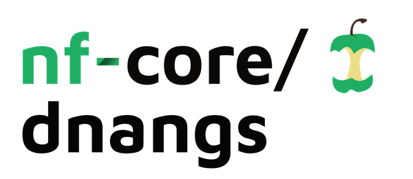

<h1>
  <picture>
    <source media="(prefers-color-scheme: dark)" srcset="docs/images/nf-core-dnangs_logo_dark.png">
    
  </picture>
</h1>

[](https://github.com/nf-core/dnangs/actions/workflows/ci.yml)
[](https://github.com/nf-core/dnangs/actions/workflows/linting.yml)[](https://nf-co.re/dnangs/results)[](https://doi.org/10.5281/zenodo.XXXXXXX)
[](https://www.nf-test.com)

[](https://www.nextflow.io/)
[](https://docs.conda.io/en/latest/)
[](https://www.docker.com/)
[](https://sylabs.io/docs/)
[](https://cloud.seqera.io/launch?pipeline=https://github.com/nf-core/dnangs)

[](https://nfcore.slack.com/channels/dnangs)[](https://twitter.com/nf_core)[](https://mstdn.science/@nf_core)[](https://www.youtube.com/c/nf-core)

## Introduction

**nf-core/dnangs** an exa ple bioinformatics pipeline for MBI lecture

This repository was created with
```
nf-core pipelines create --name dnangs --author "Piotr Suszyński" --description "Example workflow"
cd nf-core-dnangs/
nf-core subworkflows install fastq_align_bwa
nf-core modules install gatk4/haplotypecaller
```

The example data can be collected using:
```
mkdir -P example_data/ref
cd example_data/ref
wget http://hgdownload.cse.ucsc.edu/goldenPath/hg19/chromosomes/chr1.fa.gz
gunzip chr1.fa.gz
mv chr1.fa ref.fa
podman run -v $PWD:/data:Z -w /data quay.io/biocontainers/bwa:0.7.17--hed695b0_7 bwa index -p /data/ref_bwa_index /data/ref.fa
podman run -v $PWD:/data:Z -w /data biocontainers/samtools:v1.9-4-deb_cv1 samtools dict /data/ref.fa -o /data/ref.dict
cd ..
# download coriell_chr1.fq.gz from https://drive.google.com/file/d/1UU2IlgQ58TerqkZglASchab5Iu9_kSKQ/view?usp=sharing
echo "sample,fastq_1,fastq_2" > samplesheet.csv 
echo "coriell_chr1,example_data/coriell_chr1.fq.gz,example_data/coriell_chr1.fq.gz" >> samplesheet.csv
```

The code presented at the lecture was placed in workflows/dnangs.nf (lines 20-21, 42-63, 83-108) as well as a few lines in conf/modules.config and nextflow.config. All the other code in this repository (including portions of this README file) was generated when the new project was generated (`nf-core pipelines create`) or downloded by nf-core as part of modules/subworflows installation.

## Usage

> [!NOTE]
> If you are new to Nextflow and nf-core, please refer to [this page](https://nf-co.re/docs/usage/installation) on how to set-up Nextflow. Make sure to [test your setup](https://nf-co.re/docs/usage/introduction#how-to-run-a-pipeline) with `-profile test` before running the workflow on actual data.


You can run the pipeline using:

```bash
nextflow run . \
  --reads 'example_data/coriell_chr1.fq.gz' \
  --input 'example_data/samplesheet.csv' \
  --bwa_index 'example_data/ref/ref_bwa_index.{amb,ann,bwt,pac,sa}' \
  --outdir 'example_data/results' \
  -profile podman
```

> [!WARNING]
> Please provide pipeline parameters via the CLI or Nextflow `-params-file` option. Custom config files including those provided by the `-c` Nextflow option can be used to provide any configuration _**except for parameters**_; see [docs](https://nf-co.re/docs/usage/getting_started/configuration#custom-configuration-files).

For more details and further functionality, please refer to the [usage documentation](https://nf-co.re/dnangs/usage) and the [parameter documentation](https://nf-co.re/dnangs/parameters).

## Pipeline output

To see the results of an example test run with a full size dataset refer to the [results](https://nf-co.re/dnangs/results) tab on the nf-core website pipeline page.
For more details about the output files and reports, please refer to the
[output documentation](https://nf-co.re/dnangs/output).

## Credits

nf-core/dnangs was originally written by Piotr Suszyński.

We thank the following people for their extensive assistance in the development of this pipeline:

<!-- TODO nf-core: If applicable, make list of people who have also contributed -->

## Contributions and Support

If you would like to contribute to this pipeline, please see the [contributing guidelines](.github/CONTRIBUTING.md).

For further information or help, don't hesitate to get in touch on the [Slack `#dnangs` channel](https://nfcore.slack.com/channels/dnangs) (you can join with [this invite](https://nf-co.re/join/slack)).

## Citations

<!-- TODO nf-core: Add citation for pipeline after first release. Uncomment lines below and update Zenodo doi and badge at the top of this file. -->
<!-- If you use nf-core/dnangs for your analysis, please cite it using the following doi: [10.5281/zenodo.XXXXXX](https://doi.org/10.5281/zenodo.XXXXXX) -->

<!-- TODO nf-core: Add bibliography of tools and data used in your pipeline -->

An extensive list of references for the tools used by the pipeline can be found in the [`CITATIONS.md`](CITATIONS.md) file.

You can cite the `nf-core` publication as follows:

> **The nf-core framework for community-curated bioinformatics pipelines.**
>
> Philip Ewels, Alexander Peltzer, Sven Fillinger, Harshil Patel, Johannes Alneberg, Andreas Wilm, Maxime Ulysse Garcia, Paolo Di Tommaso & Sven Nahnsen.
>
> _Nat Biotechnol._ 2020 Feb 13. doi: [10.1038/s41587-020-0439-x](https://dx.doi.org/10.1038/s41587-020-0439-x).
